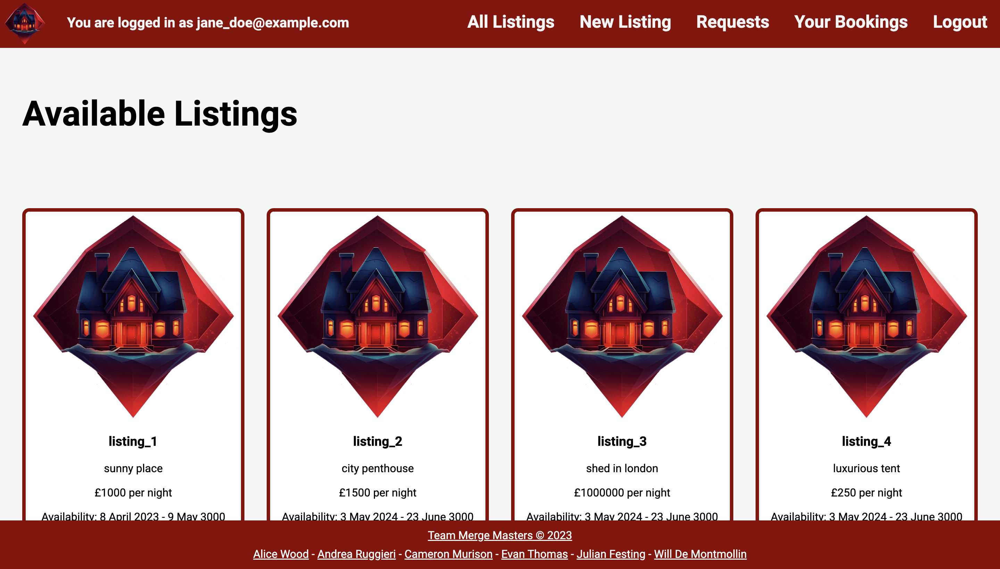

# Merge Masters BNB

## Introduction
Merge Masters BnB is an AirBnB clone made as the first group engineering project for [Makers Academy](https://github.com/makersacademy). The app allows a user to create an account and add listings that can be rented out over a range of dates. Users can also browse other users' listings and request to book them. Users can check requests made on their listings and choose whether to accept them.

## Process and Tech
We followed Agile best practices to complete this project over the span of a week. Merge Masters BnB is a full stack web app built with Ruby, Sinatra, and PostgreSQL. We used test driven development with RSpec. 

## Demonstration

### The user lands on the log in or sign up page.


### After successfully signing up and logging in, they can see all the listings posted on the site.


### The user can click through to a listing and request a booking.


### They can look at their bookings to see whether they have been confirmed.


### They can also make their own listings.


### The requests page shows all the booking requests made on their listings. This is where they can accept requests.


## How to Install and Run the Project
```bash
# Install gems
bundle install

# Run the tests
rspec

# Run the server (better to do this in a separate terminal).
rackup
```
## How to Use the Project

After the above steps have been completed and rackup is installed, simply type rackup into your terminal and in your web browser, go to http://localhost:9292

## Credits

*** [Alice Wood](https://github.com/aliceswood), [Andrea Ruggieri](https://github.com/aandre6891), [Cameron Murison](https://github.com/CKMurison), [Evan Thomas](https://github.com/ev-th), [Julian R Festing](https://github.com/Raphael40), [Will de Montmollin](https://github.com/awdem) *** 
